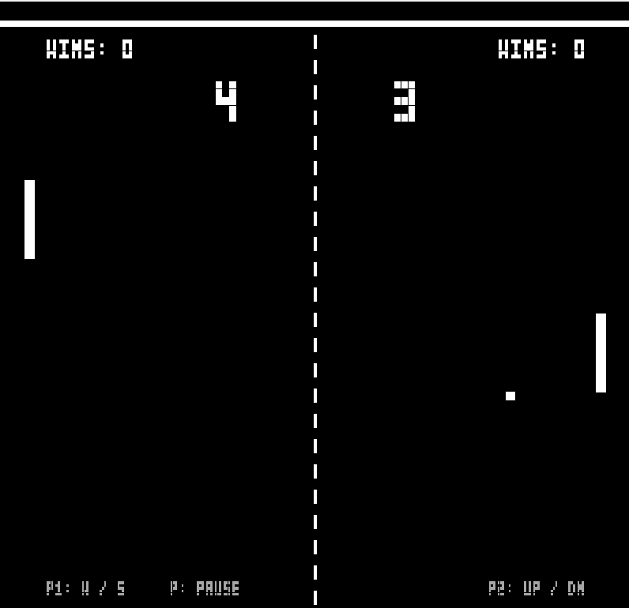

# 🏓 Ping Pong 2D

[](https://en.cppreference.com/w/cpp/20)
[](https://www.opengl.org/)
[](https://www.glfw.org/)
[](https://www.microsoft.com/windows)
[](#)

An authentic, retro 2-player arcade Pong game engineered from scratch in **C++20** and modern **OpenGL 4.6 (Core Profile)**. Inspired by the classic Atari arcade sensation, it features custom GLSL shaders, procedural vector geometry, an in-house 5×3 bitmap typography rasterizer, progressive rally acceleration, and realistic angle-deflective paddle physics.

---

## 📸 In-Game Preview



*Real-time local 2-player match showcasing custom retro scoreboard, multi-match win tally blocks, CRT backdrop texture, and Atari-style dashed net.*

---

## 🕹️ Controls & Hotkeys

| Player / Action | Keybinding | Description |
| :--- | :--- | :--- |
| **Player 1 (Left Paddle)** | <kbd>W</kbd> | Move paddle upward |
| | <kbd>S</kbd> | Move paddle downward |
| **Player 2 (Right Paddle)** | <kbd>▲</kbd> *(Up Arrow)* | Move paddle upward |
| | <kbd>▼</kbd> *(Down Arrow)* | Move paddle downward |
| **Pause / Resume** | <kbd>P</kbd> | Freeze / unfreeze gameplay simulation at any time |
| **Play Next Match** | <kbd>Space</kbd> or <kbd>Enter</kbd> | Start a new round after a match winner is crowned |
| **Reset All Records** | <kbd>R</kbd> | Reset all current scores and career win counters to 0 |

---

## ⚙️ How the Game Runs

### 1. 🔄 The Game Loop & Timing
* **Delta-Time Regulated Physics:** Frame delta time is tracked each tick using `glfwGetTime()`. It is capped at a maximum of `0.05s` (20 FPS minimum step) to prevent physics tunneling or frame-rate spikes during sudden lag intervals.
* **Separation of Concerns:** Each frame of the main game loop sequentially executes:
  1. **Input Polling:** Reads keyboard state via GLFW and toggles pause/restart states.
  2. **Physics & Collision Simulation:** Applies paddle velocity, increments ball trajectory, tests boundary and paddle intersections, and detects goal scores.
  3. **Title Bar State Updates:** Synchronizes active scores and game statuses with the OS window title.
  4. **Render Pass:** Clears the color buffer, renders the background texture quad, and draws all active playfield primitives and bitmap typography through custom shaders.
  5. **Buffer Swapping:** Swaps front and back buffers via double-buffering for flicker-free 60+ FPS rendering.

### 2. 📐 Normalized Coordinate Space (NDC)
* The playfield operates entirely in OpenGL **Normalized Device Coordinates (NDC)** ranging from `[-1.0, 1.0]`:
  * **Playfield Boundaries:** Top rail at `Y = +0.92`, Bottom rail at `Y = -0.92`.
  * **Paddle Coordinates:** Player 1 fixed at `X = -0.92`, Player 2 fixed at `X = +0.888`.
  * **Goal Lines:** Off-screen boundary triggers at `X < -1.08` (Player 2 scores) and `X > +1.08` (Player 1 scores).

### 3. 🎨 Modern OpenGL Rendering Pipeline
* **Core Profile 4.6:** Zero reliance on deprecated immediate-mode (`glBegin`/`glEnd`). All geometry is represented through Vertex Array Objects (**VAO**), Vertex Buffer Objects (**VBO**), and Element Buffer Objects (**EBO**).
* **Two Specialized Shaders:**
  * `default.vert` & `default.frag`: Renders the full-screen quad mapped with the vintage CRT backdrop texture (`background.png`).
  * `pong.vert` & `pong.frag`: Optimized geometry shader that takes a single reusable unit quad and transforms it instantly via `offset`, `scale`, and `color` uniform vectors.
* **Zero External Font Overhead:** Instead of linking heavy font loaders like FreeType, the game features a custom **5×3 pixel bitmap font engine** (`GetCharBitmap`). Alphanumeric characters are encoded into 8-bit binary masks (`0b111`, etc.) and dynamically rendered directly as geometric quad pixels.

---

## ✨ Features & Game Mechanics

### 🏓 1. Physics & Ball Dynamics
* **Angle-Deflective Paddle Bounces:** 
  The return angle is calculated based on where the ball makes contact relative to the paddle center:
  $$\text{Bounce Angle} = \left(\frac{y_{\text{ball}} - y_{\text{paddle}}}{\text{Paddle Half Height}}\right) \times 55^\circ$$
  Striking with the edge produces high-angle slice shots (up to $\pm 55^\circ$), allowing skilled players to outmaneuver opponents.
* **Progressive Rally Acceleration:**
  Every time a paddle returns the ball, ball speed increases by **5%** (`Ball_speed_increment = 1.05`), accelerating up from `1.15` units/sec to a blistering maximum cap of `2.40` units/sec.
* **Anti-Tunneling & Push-Out Correction:**
  Whenever overlap is detected, the ball is immediately projected outside the paddle's bounding volume before inverting horizontal velocity. This prevents the ball from getting trapped or vibrating inside paddles.
* **Smart Serve Sequence:**
  * After each goal, play pauses for a **0.8-second serve delay** so players can prepare.
  * The ball automatically serves toward the player who just conceded the point.
  * The serve angle incorporates a randomized launch variance between $-35^\circ$ and $+35^\circ$.

### 🏆 2. Match Scoring & Series Tracking
* **First to 7 Points:** The first player to reach 7 points wins the match.
* **Series Victory Counters:** Each player has an on-screen `WINS: X` counter.
* **Visual Tally Blocks:** Up to 10 victory tally blocks are drawn beneath each player's win header to visually display dominance over a long gaming session.
* **Dynamic Window Title:** Current scores and game states are continuously reflected in the window title bar:
  `Ping Pong 2D | P1: 3 (Wins: 1)  -  P2: 5 (Wins: 0) [PAUSED - PRESS P TO RESUME]`

### 📺 3. Retro HUD & Overlays
* **Giant Score Digits:** Vintage scoreboard numbers centered on either side of the net.
* **Ice Cyan Pause Banner:** Freezes physics and displays `PAUSED - PRESS P TO RESUME`.
* **Golden Victory Banner:** Proclaims `PLAYER 1 WINS!` or `PLAYER 2 WINS!` alongside instructions to press <kbd>Space</kbd> for the next match or <kbd>R</kbd> to reset all records.
* **Bottom Controls Guide:** Subtle in-game footer reminds players of paddle and pause controls.

---

## 🗂️ Project Structure

```text
Ping_Pong_2D/
├── assets/
│   ├── gameplay.png              # In-game preview screenshot
│   ├── shaders/
│   │   ├── default.vert          # Background texture vertex shader
│   │   ├── default.frag          # Background texture fragment shader
│   │   ├── pong.vert             # Transform quad vertex shader (offset/scale)
│   │   └── pong.frag             # Primitive coloring fragment shader
│   └── textures/
│       └── background.png        # Retro arcade CRT backdrop texture
├── Dependencies/
│   ├── GLAD/                     # OpenGL loader (glad.c and API headers)
│   ├── GLFW/                     # Windowing & input library (headers + MinGW binaries)
│   └── stb/                      # stb_image.h image loading library
├── source/
│   ├── Pong.cpp                  # Main game logic, physics loop, font rasterizer & entry point
│   └── engine/                   # Modern OpenGL object abstractions
│       ├── EBO.h / EBO.cpp       # Element Buffer Object wrapper
│       ├── VAO.h / VAO.cpp       # Vertex Array Object wrapper
│       ├── VBO.h / VBO.cpp       # Vertex Buffer Object wrapper
│       ├── ShaderClass.h / .cpp  # GLSL shader program compilation & linking
│       ├── Texture.h / Texture.cpp # OpenGL 2D texture generation & binding
│       ├── glad.c                # GLAD OpenGL loader source
│       └── stb.cpp               # stb_image implementation translation unit
├── .vscode/                      # VS Code tasks & launch configuration
├── build.ps1                     # Automated build, link, asset copy, and run script
└── README.md                     # Project documentation
```

---

## 🚀 How to Build and Run

### 📋 Prerequisites
* **Operating System:** Windows 10 or Windows 11 (64-bit)
* **Compiler:** MinGW-w64 (`g++` with C++20 support)
  * Easily installed via WinGet:
    ```powershell
    winget install BrechtSanders.WinLibs.POSIX.UCRT
    ```
  * Or verify with: `g++ --version`
* **Shell:** PowerShell 5.1+

---

### Option 1: Automated PowerShell Script (Recommended)

Run the included automated build script from the project root:

```powershell
.\build.ps1
```

* Automatically detects `g++` from system `PATH` or WinGet directories.
* Statically links MinGW runtime libraries (`-static -static-libgcc -static-libstdc++`) for maximum portability.
* Compiles all engine units, copies the `assets/` directory to `Debug/`, and immediately starts `Pong.exe`.

> **Compile only (without launching):**
> ```powershell
> .\build.ps1 -NoRun
> ```

---

### Option 2: Visual Studio Code

1. Open the `Ping_Pong_2D` folder in **Visual Studio Code**.
2. Press <kbd>Ctrl</kbd> + <kbd>Shift</kbd> + <kbd>B</kbd> and select **Run Pong** (or **Build Pong**).
3. Alternatively, open the **Run & Debug** panel (<kbd>Ctrl</kbd> + <kbd>Shift</kbd> + <kbd>D</kbd>) and select **Play Pong** (<kbd>F5</kbd>).

---

### Option 3: Manual Command-Line Build (MinGW g++)

You can compile the executable manually using PowerShell:

```powershell
g++ -std=c++20 -mwindows -static -static-libgcc -static-libstdc++ `
  source/Pong.cpp `
  source/engine/glad.c `
  source/engine/EBO.cpp `
  source/engine/ShaderClass.cpp `
  source/engine/stb.cpp `
  source/engine/Texture.cpp `
  source/engine/VAO.cpp `
  source/engine/VBO.cpp `
  -Isource `
  -Isource/engine `
  -IDependencies/GLAD/include `
  -IDependencies/GLFW/include `
  -IDependencies/stb `
  -LDependencies/GLFW/lib-mingw-w64 `
  -lglfw3 -lopengl32 -lgdi32 `
  -o Debug/Pong.exe

# Copy assets and launch
Copy-Item -Path "assets" -Destination "Debug" -Recurse -Force
.\Debug\Pong.exe
```

---

### Option 4: Direct Precompiled Execution

If the project has already been built:

```powershell
.\Debug\Pong.exe
```

---

## 🛠️ Troubleshooting & Notes

* **Windows Smart App Control (SAC) / Defender Notice:**
  On modern Windows 11 systems, Smart App Control or local execution policies may block freshly compiled, unsigned `.exe` files. If blocked:
  1. Open **Windows Settings** $\rightarrow$ **Privacy & Security** $\rightarrow$ **Windows Security**.
  2. Click **App & browser control** $\rightarrow$ **Smart App Control settings**.
  3. Set to **Off** or enable **Developer Mode** in **System $\rightarrow$ For Developers**.
* **Missing Assets / Textures at Launch:**
  The game includes a smart path resolver (`FindAssetPath`) that automatically searches for `./assets/` and `../assets/`. Always launch the game from either the project root or the `Debug/` directory to ensure textures and shaders load correctly.
* **Header Ordering Notice:**
  If modifying the source code, always make sure `<glad/glad.h>` is included **before** `<GLFW/glfw3.h>` to avoid OpenGL header redefinition conflicts.
